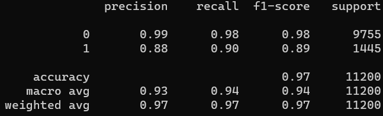
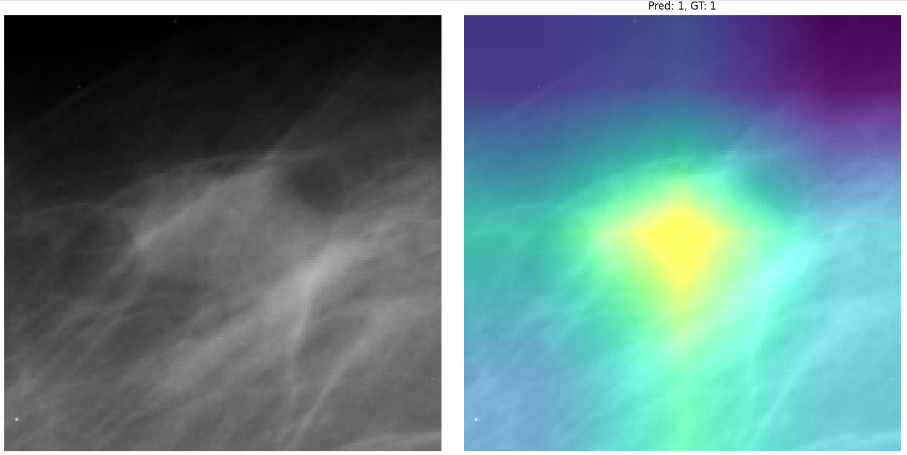

# DMDetect

Code relevant for training, evaluating, assessing and deploying CNN classifiers for Digital Mammography (DM) image classification.

The project and code is defined is such a way that it should be able to deployed out-of-the-box, given that the project structure is defined as below.
For instance, I have tested this both on a local Win10 machine and using Google Colab without any issues, see notebooks/ for jupyter notebook examples.
For this project we have used TensorFlow 2.4 (with CUDA 11). This enabled us to experiment with TFRecords and tf.data.Dataset, which is suitable for efficient batch generation during training, as well as data augmentation using GPU.

### Preliminary results

I've trained a CNN that detects images containing breast cancer tumour tissue. We get quite good results, without really tuning the network or training for long. A summary of the results can be seen below:

<!-- 
   Classes   |  Precision  |  Recall  |  F1-score  |  Support    
-------------|-------------|----------|------------|----------
           0 |    0.99     |   0.98   |    0.98    |   9755
           1 |    0.88     |   0.90   |    0.89    |   1445
-------------|-------------|----------|------------|----------
  Accuracy   |             |          |    0.97    |  11200
 macro avg   |    0.93     |   0.94   |    0.94    |  11200
weighted avg |    0.97     |   0.97   |    0.97    |  11200
--->



Reaching a macro-average F1-score of 94% is a good start.

### Explainable AI (XAI)

To further assess the performance of the method, I used XAI to see if the method is doing what it should:



From this image, it seems like the model is reacting on the right part of the image. However, the network seems biased towards "always" using the central part of the image, at least as a default, if nothing else is found. This might be suboptimal. I will experiment with different data augmentation designs to assess whether can make the design more robust.

### Free-to-use data set
The data set used can be downloaded from [here](https://www.kaggle.com/skooch/ddsm-mammography/discussion/225969). When downloaded, uncompress and place the folder structure in the data/ folder (see Project structure below).

### How to use?

Given that you have: 
1. Created a virtual environent (not necessary, but smart to do)
2. Installed all requirements
3. Defined the project as below
4. Placed the uncompressed data set in the data/ folder 

...you should be all set. Given that you are using **Google Colab**, see example jupyter notebooks in notebooks/ for more information.

Simply train a CNN classifier running the train.py script: 
```
python train.py
```

When a model is ready (see output/models/), it can be evaluated using the eval.py script, which will return summary performance results, as well as the option to further assess the model using XAI.
```
python eval.py
```

### Project structure

```
+-- {DMDetect}/
|   +-- python/
|   |   +-- create_data.py
|   |   +-- train.py
|   |   +-- [...]
|   +-- data/
|   |   +-- folder_containing_the_unzipped_kaggle_dataset/
|   |   |   +-- fold_name0/
|   |   |   +-- fold_name1/
|   |   |   +-- [...]
|   +-- output/
|   |   +-- history/
|   |   |   +--- history_some_run_name1.txt
|   |   |   +--- history_some_run_name2.txt
|   |   |   +--- [...]
|   |   +-- models/
|   |   |   +--- model_some_run_name1.h5
|   |   |   +--- model_some_run_name2.h5
|   |   |   +--- [...]
```

### TODOs (most important from top to bottom):

- [x] Setup batch generation through TFRecords for GPU-accelerated generation and data augmentation
- [x] Introduce smart losses and metrics for handling class-imbalance 
- [x] Make end-to-end pipeline for automatic DM assessment
- [x] Achieve satisfactory classification performance
- [x] Introduce XAI-based method to further assess classifier
- [x] Test MTL design on the multi-classification tasks
- [x] Made proper support for MIL classifiers, that works both during training and inference 
- [x] Fix data augmentation scheme in the get_dataset method
- [x] Updated paths to be more generic
- [x] Added Jupyter Notebook relevant for deployment on Google Colab
- [ ] Find the optimal set of augmentation methods
- [ ] Get access to raw DM images, and test the pipeline across the full image (model trained on patches)
- [ ] Extract the distrbution between the 5 classes, to be used for balancing classes during training
- [ ] Introduce ROC-curves and AUC as additional metric for evaluating performance
- [ ] Make simple script for plotting losses and metrics as a function of epochs, using the CSV history

### Small tips

Make virtual environment (Not necessary):\
`virtualenv -ppython3 venv --clear`

Activating virtual environment:\
On Win10: `.\venv\Scripts\activate.ps1`\
On Linux: `source venv/bin/activate`

Install dependencies from requirement file:\
`pip install -r requirements.txt`

Updating requirements.txt file:\
`pip freeze > requirements.txt`
