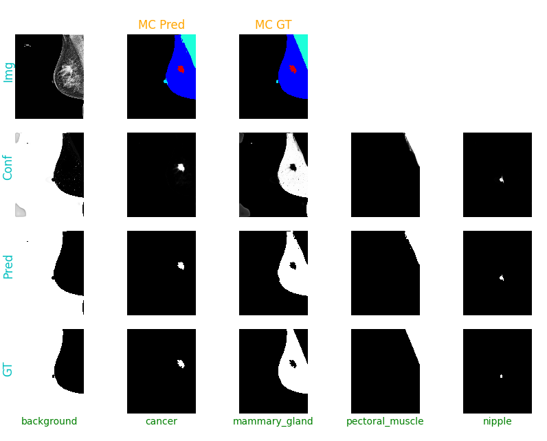

# DMDetect
[](https://github.com/DAVFoundation/captain-n3m0/blob/master/LICENSE)

Open-source project for training, evaluating, assessing and deploying Convolutional Neural Networks (CNNs) for multi-class image classification and segmentation of Digital Mammography (DM) images.



The project and code is defined such that it should be easy to use out-of-the-box, given that the project structure is defined as [below](https://github.com/andreped/DMDetect/blob/main/README.md#project-structure).
For instance, I have tested the project both on a local Win10 machine and using Google Colab without any issues, see notebooks/ for jupyter notebook example(s).

For this project we have used TensorFlow 2.4 (with CUDA 11). This enabled us to experiment with TFRecords and tf.data.Dataset, which is suitable for efficient batch generation during training, as well as GPU-accelerated data augmentation.

### Preliminary results

#### Segmentation

I've trained a ResU-Net++ model, inputting images of 1024x1024 (preserved aspect ratio, vertical axis as reference). The model is trained to perform multi-class semantic segmentation of cancer, mammary gland, pectoral muscle and nipple:

| metrics | cancer | mammary gland | pectoral muscle | nipple | overall |
|---------|--------|---------------|-----------------|--------|---------|
|   DSC   | 0.279  |     0.976     |      0.946      | 0.474  |  0.669  |
|   IOU   | 0.220  |     0.955     |      0.920      | 0.373  |  0.617  |

Due to the downsampling of images, too much information is lost to produce satisfactory tumour segmentation (in terms on DSC/IOU). Improvements can be made by working patch-wise, working with full or higher resolution, but it might degrade performance on other classes, so it depends on the use case.


#### Classification

I've trained a CNN that detects images containing breast cancer tissue. We get quite good results, without really tuning the network or training for long. A summary of the results can be seen below:

<!-- 
   Classes   |  Precision  |  Recall  |  F1-score  |  Support    
-------------|-------------|----------|------------|----------
           0 |    0.99     |   0.98   |    0.98    |   9755
           1 |    0.88     |   0.90   |    0.89    |   1445
-------------|-------------|----------|------------|----------
  Accuracy   |             |          |    0.97    |  11200
 macro avg   |    0.93     |   0.94   |    0.94    |  11200
weighted avg |    0.97     |   0.97   |    0.97    |  11200
--->


Reaching a macro-average F1-score of 94% is a good start.

### Explainable AI (XAI)

To further assess the performance of the method, XAI was used (in this case [Grad-CAM](https://arxiv.org/abs/1610.02391), using this [repo](https://github.com/sicara/tf-explain)) to see if the method is doing what it should:


From this figure, it seems like the model is reacting on the correct part of the image. However, overall the network seems biased towards "always" using the central part of the image, at least as a default, if nothing else is found. This might be suboptimal. I will experiment with different data augmentation designs to assess whether one can make the current design more robust.

### Free-to-use data set
The data set used can be downloaded from [here](https://www.kaggle.com/skooch/ddsm-mammography/discussion/225969). When downloaded, uncompress and place the folder structure in the data/ folder (see Project structure [below](https://github.com/andreped/DMDetect/blob/main/README.md#project-structure)).

### How to use?

Given that you have: 
1. Created a virtual environent (not necessary, but smart to do)
2. Installed all requirements
3. Defined the project as [below](https://github.com/andreped/DMDetect/blob/main/README.md#project-structure)
4. Placed the uncompressed data set in the data/ folder

...you should be all set. Given that you are using **Google Colab**, see jupyter notebook examples in notebooks/ for more information.

#### Classification
In this case, we are using a [DDSM Kaggle data set](https://www.kaggle.com/skooch/ddsm-mammography), which has already been preprocessed in a format which we can process on-the-fly in the batch generator. Thus, simply train a CNN classifier running the train.py script: 
```
python train.py
```

When a model is ready (see output/models/), it can be evaluated using the eval.py script, which will return summary performance results, as well as the option to further assess the model using XAI.
```
python eval.py
```

#### Segmentation
As the data is not preprocessed, it is necessary to do that first:
```
python create_data.py
```

Then simply train a deep segmentation model running:
```
python train_seg.py
```

To evaluate the model, as well as the option to view results, run:
```
python eval_seg.py
```

### Project structure

```
+-- {DMDetect}/
|   +-- python/
|   |   +-- create_data.py
|   |   +-- train.py
|   |   +-- [...]
|   +-- data/
|   |   +-- folder_containing_the_unzipped_kaggle_dataset/
|   |   |   +-- fold_name0/
|   |   |   +-- fold_name1/
|   |   |   +-- [...]
|   +-- output/
|   |   +-- history/
|   |   |   +--- history_some_run_name1.txt
|   |   |   +--- history_some_run_name2.txt
|   |   |   +--- [...]
|   |   +-- models/
|   |   |   +--- model_some_run_name1.h5
|   |   |   +--- model_some_run_name2.h5
|   |   |   +--- [...]
```

### TODOs (most important from top to bottom):

- [x] Setup batch generation through TFRecords for GPU-accelerated generation and data augmentation
- [x] Introduce smart losses and metrics for handling class-imbalance 
- [x] Make end-to-end pipeline for automatic DM assessment
- [x] Achieve satisfactory classification performance
- [x] Introduce XAI-based method to further assess classifier
- [x] Test MTL design on the multi-classification tasks
- [x] Made proper support for MIL classifiers, that works both during training and inference 
- [x] Fix data augmentation scheme in the get_dataset method
- [x] Updated paths to be more generic
- [x] Added Jupyter Notebook relevant for deployment on Google Colab
- [x] Get access to semantically annotated data of breast cancer
- [x] Setup full pipeline for training and evaluating segmentation models
- [ ] Find the optimal set of augmentation methods
- [ ] Get access to raw DM images, and test the pipeline across the full image (model trained on patches)
- [ ] Extract the distrbution between the 5 classes, to be used for balancing classes during training
- [ ] Introduce ROC-curves and AUC as additional metric for evaluating performance
- [ ] Make simple script for plotting losses and metrics as a function of epochs, using the CSV history
- [ ] Add option to set arguments for training/evaluation using [argparse](https://docs.python.org/3/library/argparse.html) or similar

### Tips

Make virtual environment (Not necessary):\
`virtualenv -ppython3 venv --clear`

Activating virtual environment:\
On Win10: `.\venv\Scripts\activate.ps1`\
On Linux: `source venv/bin/activate`

Deactivating virtual environment:\
`deactivate`

Install dependencies from requirements file:\
`pip install -r requirements.txt`

Updating requirements.txt file:\
`pip freeze > requirements.txt`

------

Made with :heart: and python
